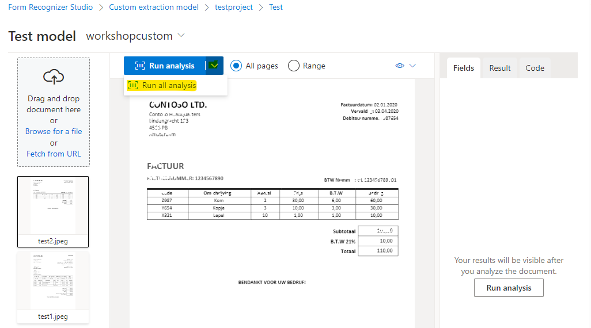
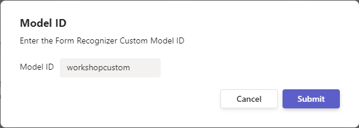

# Create and Deploy a Form Recognizer Custom Model

### Overview
In this lab, you will create (train) an Azure Form Recognizer custom model using a sample training dataset. Custom models extract and analyze distinct data and use cases from forms and documents specific to your business. To create a custom model, you label a dataset of documents with the values you want extracted and train the model on the labeled dataset. You only need five examples of the same form or document type to get started. For this lab, you will use the dataset provided at [Custom Model Sample Files](/SampleInvoices/Custom%20Model%20Sample/)..

### Goal
* Use a sample training data set to train a custom model in the Azure Form Recognizer Studio
* Label the training data documents with custom fields of interest 
* Test the trained model on test data, visualized results and confidence score in the Studio
* Use the custom model in the BPA pipeline

### Pre-requisites
* The accelerator is deployed and ready in the resource group
* You have an Azure subscription and permission to create a Form Recognizer Resource
* You have access to sample invoices folder with the invoices to upload

### Instructions

### Step 1 Creating a Form Recognizer Resource

#### 1.1 Go to the Resource group and select the "Cognitive services multi-service account" resource type

#### 1.2 Click on Form Recognizer tab and select "Go to Studio"

#### 1.3 In Form Recognizer Studio, under Custom models, choose Create new

#### 1.4 Create a new project

#### 1.5 Fill in project details

#### 1.6 Fill in details for configuring service resource. For Form Recognizer or Cognitive Service Resource, choose the one available from your drop-down menu. Choose the General Available API version 2022-08-31

#### 1.7 Configure data source details and for storage account, choose create new storage account

#### 1.8 validate the information and choose create project

### Step 2 Train and Label data
In this step, you will upload 5 training documents to train the model.

#### 2.1 Upload sample data 
Use the data folder on VM desktop and go to [Custom Model Sample](/SampleInvoices/Custom%20Model%20Sample/) files and pick 5 files marked as train. Once uploaded, choose Run now in the pop-up window under Run Layout.

#### 2.2 Add a field

#### 2.3 Label the new field added by selecting the CONTOSO LTD in the top left of each document uploaded. Do this for all the five documents.

#### 2.4 Once all the documents are labelled, choose Train in the top right corner

#### 2.5 Specify a model ID and choose Template for the Build Mode. Save this Model ID somewhere as you will be needing it in next steps.

#### 2.6 Go to Models. Wait till the model status shows succeeded.

Select the model you created and choose Test.

#### 2.7 In the Test model window, use the sample files marked as test from the [same location](/SampleInvoices/Custom%20Model%20Sample/) where you picked the files for training. Once uploaded, choose Run all analysis.

#### 2.8 Now you can see on the right hand side, the model was able to detect the field "Organization_sample" we created in the last step along with its confidence score

### Step 3 Build new pipeline with custom model module in BPA

After you are sastified with the custom model performance, you can retrieve the model ID and use it in a new BPA pipeline with the Cusom Model module in the next step.

#### 3.1 Launch BPA Accelerator

Navigate to the Resource Group and select the resource group which is already created for you.

#### 3.2 Select the static web app and click on the URL

#### 3.3 Choose Create/Update/Delete Pipelines option and create a new pipeline by specifying a name

#### 3.4 Select PDF Document

#### 3.5 Select Form Recognizer custom model (batch) option and specify the model ID you gave in Step 2. 

Click on Done

#### 3.6 Now you will be ingesting documents by going to the Home page of BPA and choosing Ingest Documents option.

#### 3.7 From the Select a pipeline drop-down, select the pipeline you just created and click on upload under upload a single document

#### 3.8 For documents, go to [Lab 1 Step 3.7](/SampleInvoices/Lab%201%20Step%203.7/) folder. You can upload multiple invoice one-by-one.

### Step 4 Configure Azure Cognitive Search 

#### 4.1 Fo back to the resource group window and select Search service

#### 4.2 Click on Import data and select Azure Blog Storage for the Data source option

For connection string, choose an existing connection and select the storage account which was created for you already. Within that, select the results container. For Blob folder, specify the name of the pipeline you created in Step 3 in BPA.

#### 4.3 Click on Add congnitive skills and skip to customize target index. Make all fields Retrievable and Searchable. Expand the documents field and under it, expand fields to make the three fields facetable (type, valueString & content).

#### 4.4 Provide a name for the indexer if not already given and select Submit. You will get a notification that the import is successfully configured

### Step 5 Use Sample Search Application

#### 5.1 Now go back to the BPA webpage and select Sample Search Application

You can now filter and search on items and other fields configured.

## More Resources  
Getting Started with Form Recognizer Studio - https://learn.microsoft.com/en-us/azure/applied-ai-services/form-recognizer/form-recognizer-studio-overview?view=form-recog-3.0.0  
Form Recognizer Documentation - https://learn.microsoft.com/en-us/azure/applied-ai-services/form-recognizer/concept-invoice?view=form-recog-3.0.0