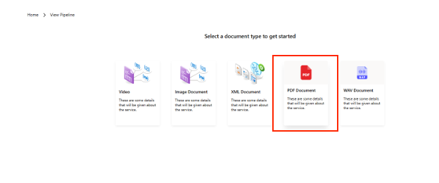
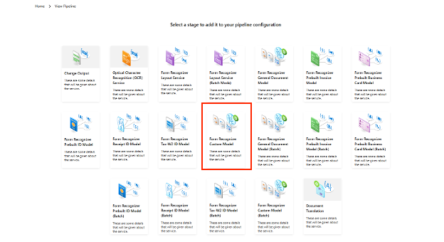

# Create and Deploy a Form Recognizer Custom Model

### Overview
In this lab, you will create (train) an Azure Form Recognizer custom model using a sample training dataset. Custom models extract and analyze distinct data and use cases from forms and documents specific to your business. To create a custom model, you label a dataset of documents with the values you want extracted and train the model on the labeled dataset. You only need five examples of the same form or document type to get started. For this lab, you will use the dataset provided at [Custom Model Sample Files](/SampleInvoices/SampleInvoices/Custom%20Model%20Sample).

### Goal
* Use a sample training data set to train a custom model in the Azure Form Recognizer Studio
* Label the training data documents with custom fields of interest 
* Test the trained model on test data, visualized results and confidence score in the Studio
* Use the custom model in the BPA pipeline from Lab 1 

### Pre-requisites
* The accelerator is deployed and ready in the resource group
* You have an Azure subscription and permission to create a Form Recognizer Resource
* You have access to sample invoices folder with the invoices to upload

### Instructions

#### Create a Custom Model  
- [Step 1 - Create a Form Recognizer Resource](#step-1---create-a-form-recognizer-resource)  
- [Step 2 - Open Form Recognizer Studio and Create a Custom Labeling Project ](#step-2---open-form-recognizer-studio-and-create-a-custom-labeling-project)  
- [Step 3 - Import the Sample Data](#step-3---import-the-sample-data)  
- [Step 4 - Train the model](#step-4---train-the-model)  
- [Step 5 - Test the Model on Test Data](#step-5---test-the-model-on-test-data)   

#### Step 1 - Create a Form Recognizer Resource  
  
  
  

#### Step 2 - Open Form Recognizer Studio and Create a Custom Labeling Project 

  

Select the **Custom Extraction Model** from the bottom of the list of options

  

Create Custom Model Project  

  
  

Provide the storage account and container containing the forms data which you will like to label  

  
  
  

#### Step 3 - Import the Sample Data  
Use the data folder on VM desktop and go to **Custom Model Sample Files** and pick 5 files marked as **train**
  
  

Create a new field which you would like to label  

  
We created the label as "Organization_sample"  

  

Apply the custom label to form fields  
  
Apply the labels to all forms by repeating the process in the previous step  
  
#### Step 4 - Train the model 
After labeling the forms, click on "Train" and provide the below information. Please note **Neural** method will take a longer duration to train but may be necessary in case of most unstructured files. If your data is mostly structured, you can use **Tabular** to make the training faster. For this workshop, we will use Tabular method to train the model.
  
  
#### Step 5 - Test the Model on Test Data
Use the sample files marked as **test** from the same location where you picked the files for training
  
  
Load the test file and click "Analyze"  
  
The results are projected with the confidence score  
  

#### Build new pipeline with custom model module in BPA  
After you are sastified with the custom model performance, you can retrieve the **model ID** and use it in a new BPA pipeline with the Cusom Model module in the next step.

#### Launch BPA Accelerator 
1. Launch the accelerator from the resource group in the Static Web App
   1. To do this go to portal.azure.com ([Azure Portal](portal.azure.com)) from a web browser and click on resource group that is created for the purpose of this lab.
   
    Click on the resource group that is created for this lab, you should be able to see resources deployed as a part of Business Process Automation accelerator deployment.
    
    > **Note :** The names will be different in your specific labs and will not exactly match with the names of the resources or resource group

    

    1. Look for the Static Web App under **type**. This is what we will use as a part of lab 1. Click on the Web App.
    
    

    Click on the URL and this will launch the accelerator
    

1. Please create the following pipeline:
 
 
 

1. Retrieve the trained **custom model ID** from the Form Recognizer Studio and Enter it into the following window:
 
 

1. Check the newly created pipeline use **View Pipeline** Option
 

1. Ingest data for the new pipeline from BPA homepage. Please make sure you select the Pipeline first before ingesting the files. For smaller files use the **Upload A Single Document** option. Otherwise for larger files use **Split Document By Page And Process** option.
 

1. To get the **Search Service**. To view the results, go to portal.azure.com ([Azure Portal](portal.azure.com)) again in your browser and get to the resource group like we did earlier in Step 1. There, in the resource group, click on the resource that is of type **Search Service**. 
    
    

1. Click on **Import Data** and Select **Azure Blob Storage** from the dropdown in datasource.
    

1. Provide a name for datasource; change the parsing mode to **Default**; click on **Choose an existing connection**  for **Connection String** and select the Storage account related to your project and choose container **document**
    

1. Keep the default for **Managed identity Authentication**, which is **None**.  

1. On the Blob folder, provide the name of **your pipeline**
    
    

1. Click **Next: Add cognitive skills (Optional)**. This validates and creates the index schema. 

1. In the next Screen(**Add cognitive skills (Optional)**), Click **Skip to: Customize Target Index**, 
      

1. In the next screen, under **aggregated results**, click on the **...** on **invoice**, click **delete** . Similarly, you can also delete **resultindexes**
    

1. Make all fields **Retrievable** and **Searchable**
    

1. Under **aggregatedResults**-> **simplifyInvoice** Select, customerName, invoiceId, invoicedate and dueDate to be filterable and sortable
    

1. Similarly, under **aggregatedResults**-> **items**, select all fields to be filterable and sortable.
    

1. Provide a name for the Index and click on **Next: Create an indexer**
    

1. Provide a name for the indexer and click **Submit**
    
    

1. You will get a notification that the import is successfully configured

1. Now, go back to the accelerator url that you retreived from Step 1 and click on **Sample Search Application**.  
    

    This opens the same search application
     

1. You can now filter and search on items and other fields configured.
## More Resources  
Getting Started with Form Recognizer Studio - https://learn.microsoft.com/en-us/azure/applied-ai-services/form-recognizer/form-recognizer-studio-overview?view=form-recog-3.0.0  
Form Recognizer Documentation - https://learn.microsoft.com/en-us/azure/applied-ai-services/form-recognizer/concept-invoice?view=form-recog-3.0.0
