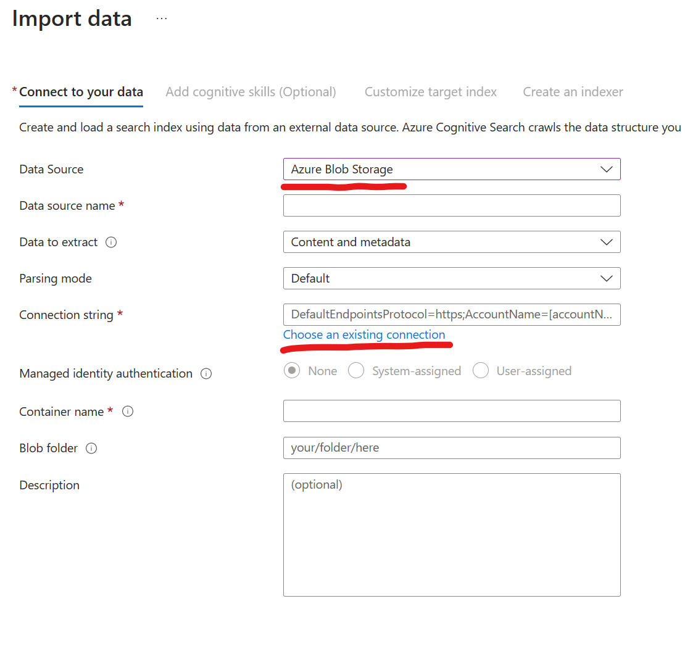
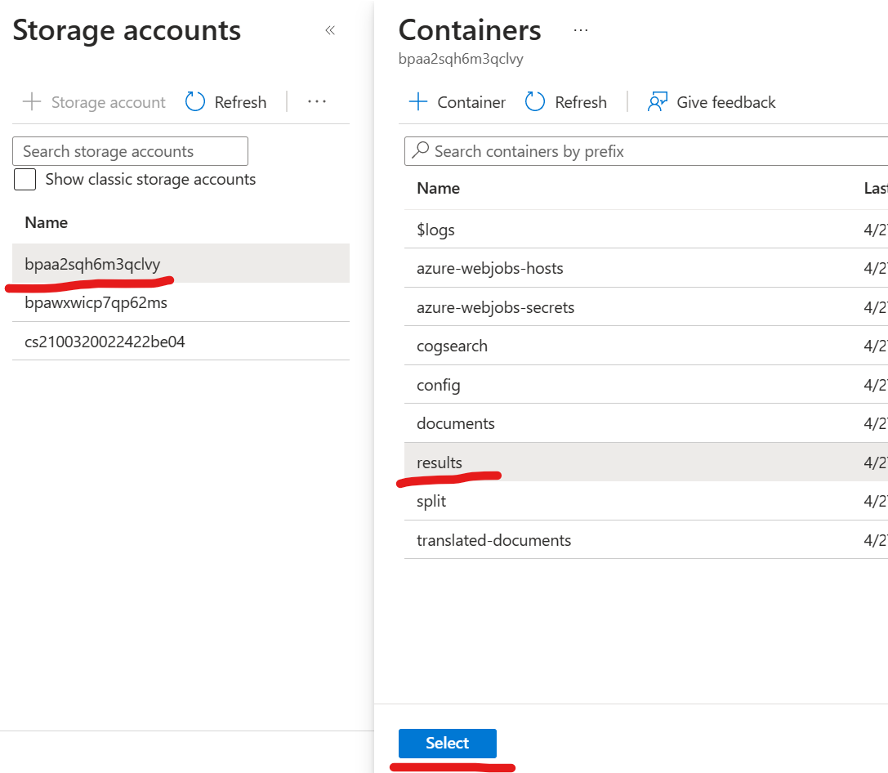
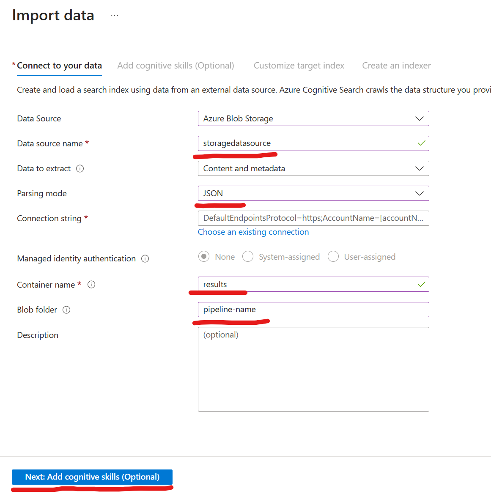
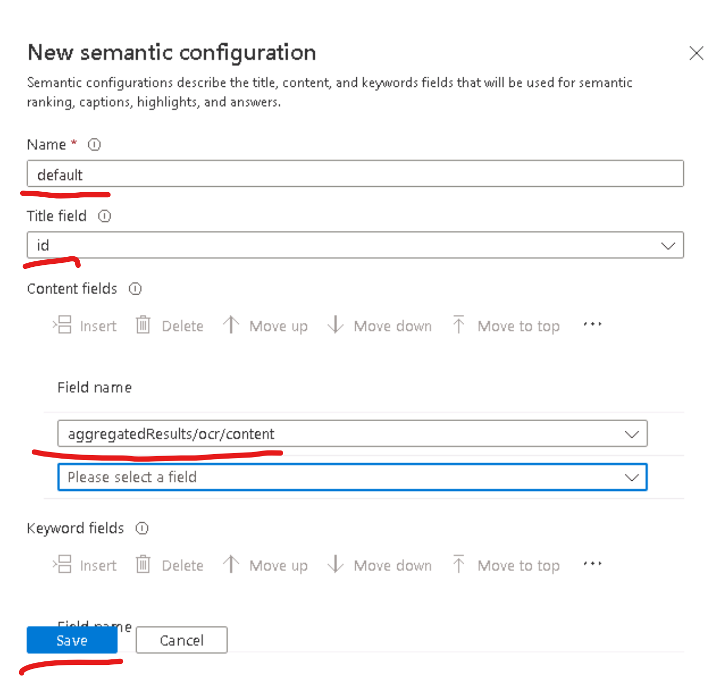
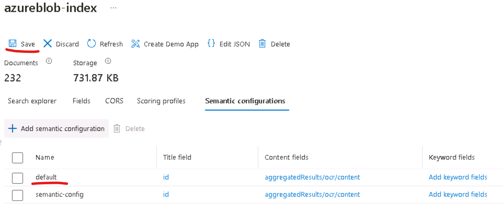

# Create and Deploy a OpenAI Pipeline

### Overview
In this lab, you will use unstructured data files like contract documents, leases, user manuals etc. to be analyzed using OCR, Azure Cognitive Search Semantic Search feature and the capabilities of Azure Open AI Large Language Models to summerize key information after converting them into more structured index files. For this lab, you will use the dataset provided at [Lab3 Sample Data](/SampleInvoices/Lab3%20Sample%20Data).

### Goal
* How to leverage the Large Language Model(LLM) from GPT-3 to extract concise summary from a subset of huge document repository using OpenAI and Azure Semantic Search 

### Pre-requisites
* The accelerator is deployed and ready in the resource group
* You have access to sample data to test OpenAI

### Instructions

#### **Step 1 - Create A Generic Pipeline**
  

  

  

  

#### **Step 2 - Ingest Data for the pipeline**

There are 2 options for ingesting the data for the pipeline:

* Use single file upload for smaller files [smaller than 4 pages]
* Use the split document option to split the larger documents and upload the individual split files to the pipeline.

#### **Step 3 - Configure Search**
1. The get to **Search Service**. To view the results, go to portal.azure.com ([Azure Portal](portal.azure.com)) again in your browser and get to the resource group like we did earlier in Step 1. There, in the resource group, click on the resource that is of type **Search Service**. 
    
    

1. Click on **Import Data**. 
    

1. Select **Azure Blob Storage** from the dropdown in datasource.

1. Provide a name for datasource and click on **Choose an existing connection**  for **Connection String**. Here the Azure Blob Storage resource created as a part of BPA accelerator already setup will be one of the sources you can choose from.
    
1. After you select your storage account, select the **results** container from the list and click **Select** button. See the screen shot below.
    

1. On the Import data screen make sure you have the following:
    - Your data source as **Azure Blob Storage**
    - You have provided data source name. For e.g. **storagedatasource**
    - You selected **JSON** as Parsing mode
    - Your container name is **results** and 
    - Your created pipeline name is entered. For instance, if your pipeline name is **pipeline-name** then enter pipeline-name
    - Keep the default for **Managed identity Authentication**, which is **None** 
   

1. Click **Next: Add cognitive skills (Optional)**. This validates and creates the index schema. 

1. In the next Screen(**Add cognitive skills (Optional)**), Click **Skip to: Customize Target Index**, 
      

1. Provide a name for the Index and click on **Next: Create an indexer**
    

1. Provide a name for the indexer and click **Submit**
    
    

1. You will get a notification that the import is successfully configured

#### **Step 4 - Configure Semantic Search**

1. You can select Semantic Search Plan
 

1. Go back to your search index and configure the Semantic Configuration

1. Select the Semantic Configuration and click on Create new. 

    On the pop up do the following:
    - Give a name to the Semantic Search Config. **For this lab, the name must be 'default'**
    - Select the Title field and select 'filename'
    - Select the 'content' field and any other relevant fields for Content Fields
    - Select Save

It is important that you name your Semantic Search Config for this lab as **default**

Do not forget to click on **save** again on the index screen. Otherwise the Semantic Search Config will not be applied.

#### **Step 5 - Perform Semantic Search**
1. Now, go back to the accelerator url that you retreived from Step 1 and click on **Sample Search Application**.  
    

    This opens the same search application

    - Enable Symantic Search
    - Select the relevant Symantic Search Config
    - Enable Open AI Summary and Answer
    - Provide a search query based on your document, like:
        - 'What is RMA?'
        - 'What are the Cleaning instructions?'
     

