# Create and Deploy a OpenAI Pipeline

### Overview
In this lab, you will create (train) an Azure Form Recognizer custom model using a sample training dataset. Custom models extract and analyze distinct data and use cases from forms and documents specific to your business. To create a custom model, you label a dataset of documents with the values you want extracted and train the model on the labeled dataset. You only need five examples of the same form or document type to get started. For this lab, you will use the dataset provided at [Custom Model Sample Files](/SampleInvoices/Custom%20Model%20Sample).

### Goal
* How to leverage the Large Language Model(LLM) from GPT-3 to extract concise summary from a subset of huge document repository using OpenAI and Azure Semantic Search 

### Pre-requisites
* The accelerator is deployed and ready in the resource group
* You have access to sample data to test OpenAI

### Instructions

#### Step 1 - Create a OpenAI Generic Pipeline  
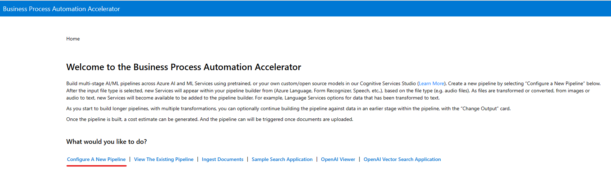  

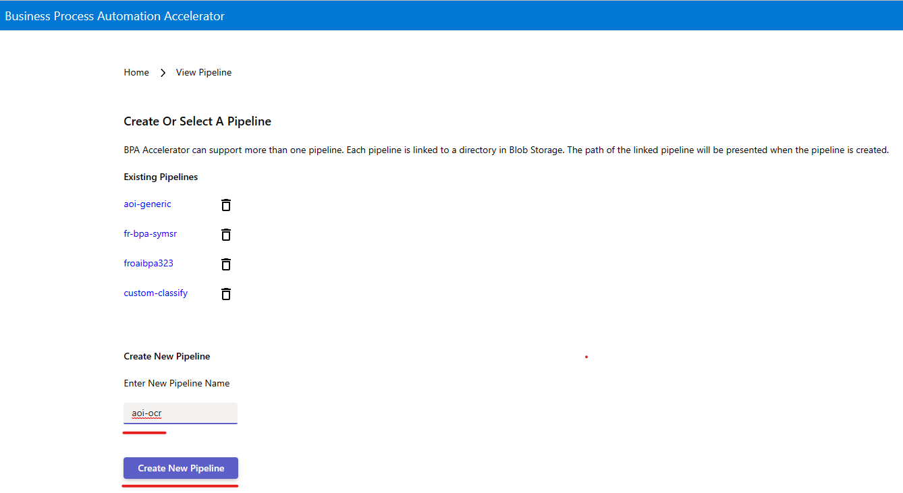  

  

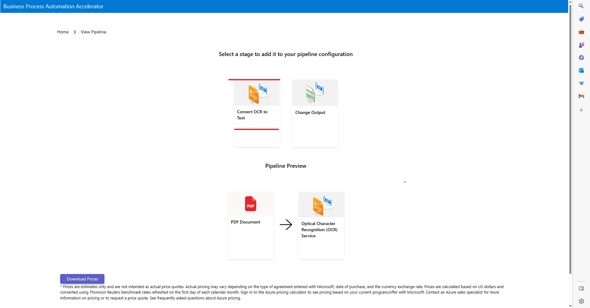  

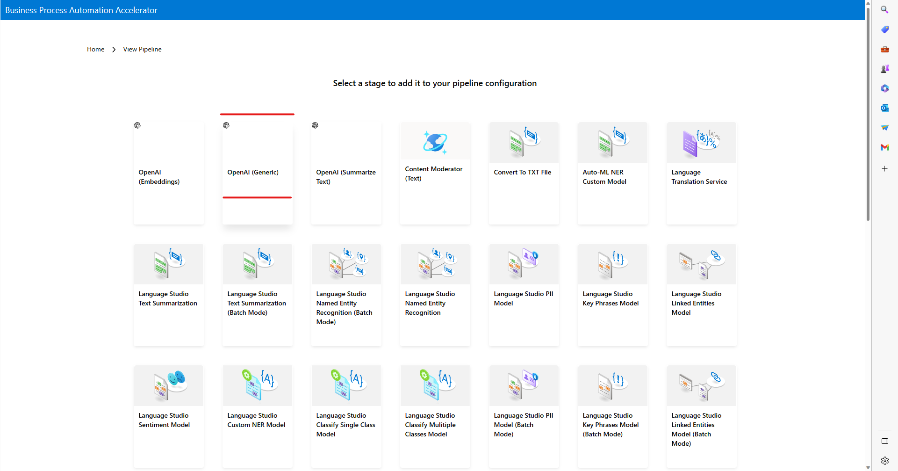

### Task 1a - Get Sample Configurations from GPT-3 Playground

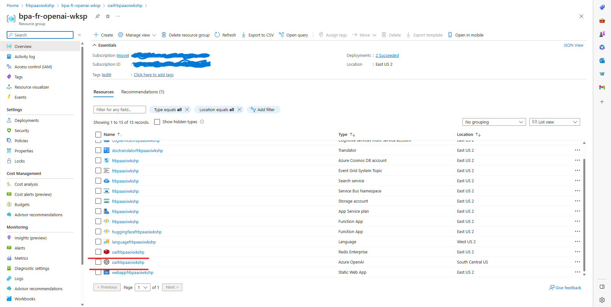  

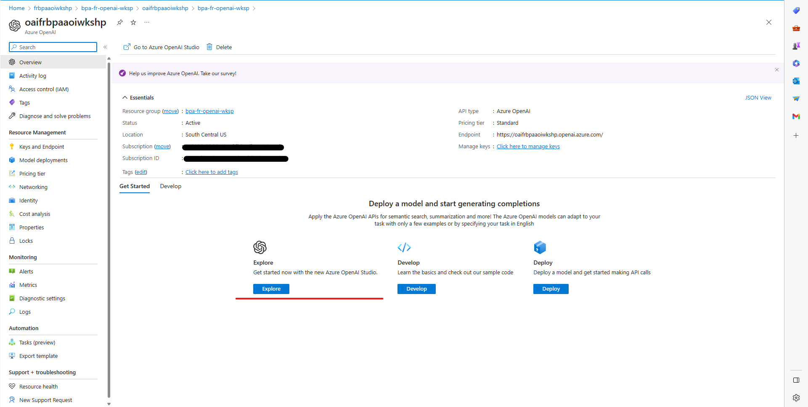  

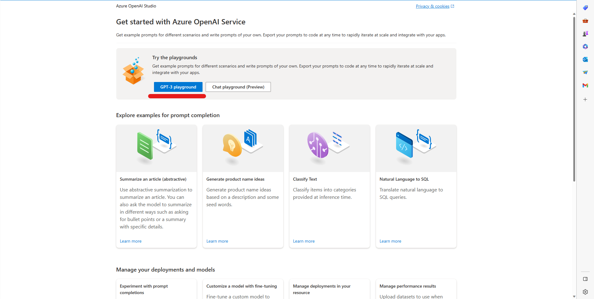  

  

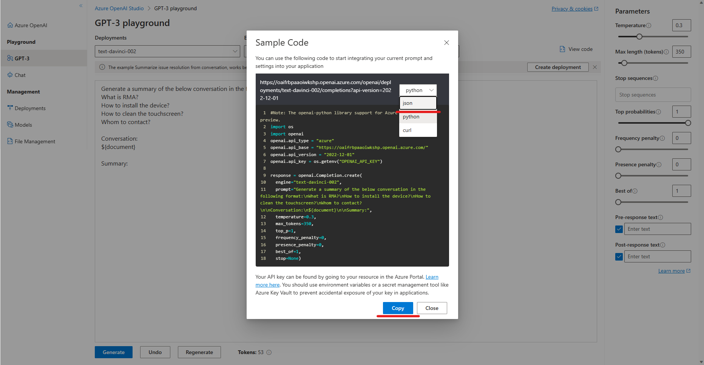  

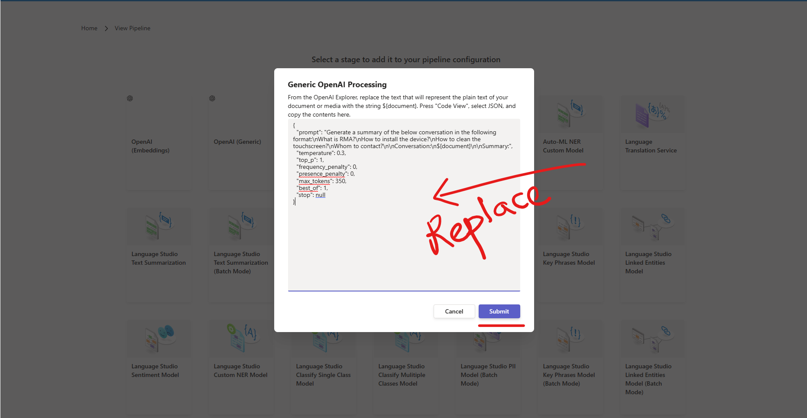  

  

#### Step 2 - Ingest Data for the pipeline 

#### Step 3 - Configure Search  
1. The get to **Search Service**. To view the results, go to portal.azure.com ([Azure Portal](portal.azure.com)) again in your browser and get to the resource group like we did earlier in Step 1. There, in the resource group, click on the resource that is of type **Search Service**. 
    
    

1. Click on **Import Data**. 
    

1. Select **Azure Cosmos DB** from the dropdown in datasource.
    

1. Provide a name for datasource and click on **Choose an existing connection**  for **Connection String**. Here the Azure CosmosDB resource created as a part of BPA accelerator already setup will be one of the sources you can choose from.
    

1. Keep the default for **Managed identity Authentication**, which is **None**. For **Databases** and **Collection** use the dropdown to select the same name as the Cosmos DB you selected at step 15. 

1. Under Query, use the following Query.  The pipeline should match the pipeline name you used in step 3
    > SELECT * FROM c WHERE c.pipeline = 'YOUR-PIPELINE-NAME' AND c._ts > @HighWaterMark

    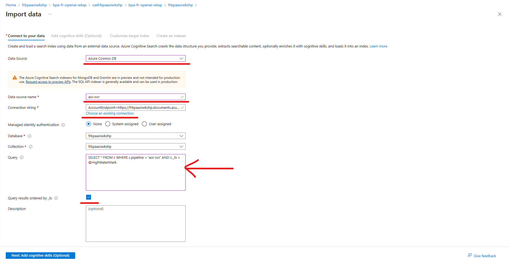

1. Click **Next: Add cognitive skills (Optional)**. This validates and creates the index schema. 

1. In the next Screen(**Add cognitive skills (Optional)**), Click **Skip to: Customize Target Index**, 
      

1. Provide a name for the Index and click on **Next: Create an indexer**
    

1. Provide a name for the indexer and click **Submit**
    
    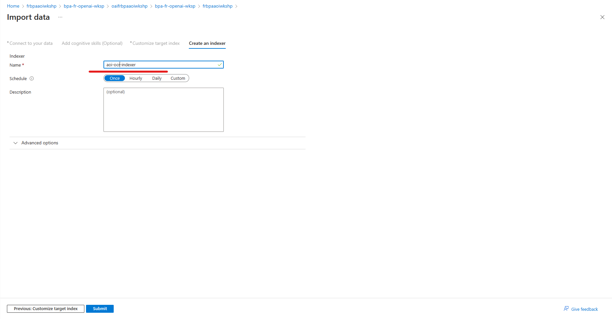

1. You will get a notification that the import is successfully configured

#### Step 4 - Configure Semantic Search 

1. You can select Semantic Search Plan
 

1. Go back to your search index and configure the Semantic Configuration

1. Select the Semantic Configuration and click on Create new. 

    On the pop up do the following:
    - Give a name to the Semantic Search Config
    - Select the Title field and select 'filename'
    - Select the 'content' field and any other relevant fields for Content Fields
    - Select Save

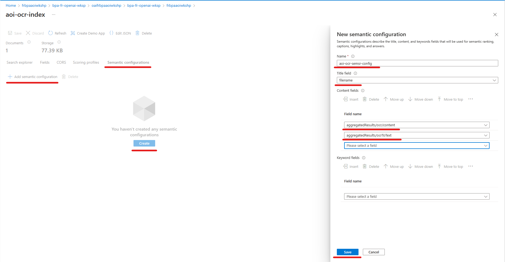

#### Step 5 - Perform Semantic Search
1. Now, go back to the accelerator url that you retreived from Step 1 and click on **Sample Search Application**.  
    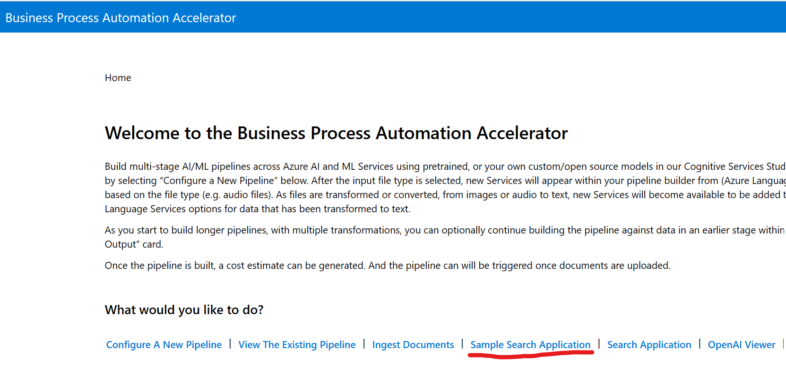

    This opens the same search application

    - Enable Symantic Search
    - Select the relevant Symantic Search Config
    - Enable Open AI Summary and Answer
    - Provide a search query based on your document, like:
        - 'What is RMA?'
        - 'What are the Cleaning instructions?'
     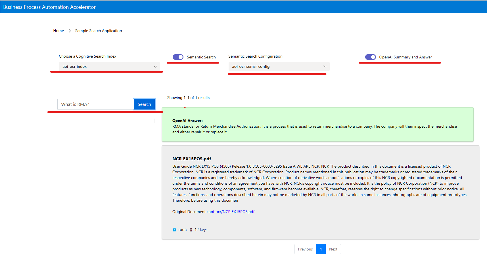

## More Resources  
Getting Started with Form Recognizer Studio - https://learn.microsoft.com/en-us/azure/applied-ai-services/form-recognizer/form-recognizer-studio-overview?view=form-recog-3.0.0  
Form Recognizer Documentation - https://learn.microsoft.com/en-us/azure/applied-ai-services/form-recognizer/concept-invoice?view=form-recog-3.0.0
